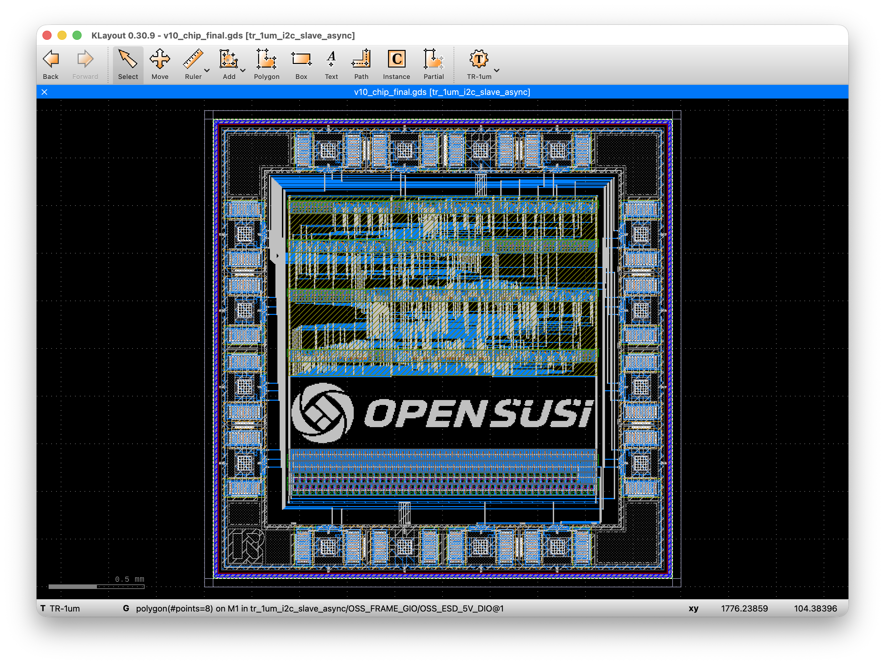

# TR-1um I2C Asynchronous Slave

Clockless (no `clk` port — every state transition is driven purely by
SCL/SDA bus edges) I2C slave core implemented on the OpenSUSI TR-1um
process, together with an on-die ring-oscillator (`RING_OSC`) test
structure sharing the chip's reset pin.

Design source, full history and design notes:
[jun1okamura/TR-1um_Async_I2C](https://github.com/jun1okamura/TR-1um_Async_I2C)
(see that repo's `design_notes.md` and this repo's [`PROVENANCE.md`](PROVENANCE.md)
for exactly what was exported here and how).

Also see below series of design note in Japanese.
- [Completing a new chip design with Claude (1)](https://qiita.com/jun1okamura/items/898248762a03492cdc33)
- [Completing a new chip design with Claude (2)](https://qiita.com/jun1okamura/items/ca2fed5c46a105ac371c)
- [Completing a new chip design with Claude (3)](https://qiita.com/jun1okamura/items/928e6e1464e75a68b394)
- [Completing a new chip design with Claude (4)](https://qiita.com/jun1okamura/items/cb8f252360014d35043a)
- [Completing a new chip design with Claude (5)](https://qiita.com/jun1okamura/items/177e9ea388ee900ca6bb)

---

## 1. チップ概要（ピン説明）

チップ本体は非同期（クロックレス）I2Cスレーブコア
（`i2c_slave_async_nrow_fm`）と、テスト用リング発振器
（`RING_OSC`）を1チップに統合したもの。16本の実ボンドパッド
（P1〜P7、VSS, P9〜P15、VDD）で構成。

| ピン | 信号 | 方向 | 説明 |
|---|---|---|---|
| P1 | `SCL` | 入力 | I2Cクロック |
| P2 | `SDA` | 双方向（オープンドレイン） | I2Cデータ。ドライバは常にLowにしか駆動しない（`sda_oe`でゲート、Highはチップ外部プルアップ任せ）。入力パスは`sda_in`。 |
| P3 | `tx_data[0]` / `rx_data[0]` | 双方向 | 汎用データピン、ビット0 |
| P4 | `tx_data[1]` / `rx_data[1]` | 双方向 | 汎用データピン、ビット1 |
| P5 | `tx_data[2]` / `rx_data[2]` | 双方向 | 汎用データピン、ビット2 |
| P6 | `tx_data[3]` / `rx_data[3]` | 双方向 | 汎用データピン、ビット3 |
| P7 | `DIS` | 入力 | P3/P4/P5/P6/P11/P12/P13/P14の8本共有の方向制御。動作中はダイナミックに切り替わる——WRITE中はLow（チップ自身の出力ドライバが有効化され、各ピンは`rx_data`を出力）、READ中・アイドル中はHigh（Hi-Z、各ピンは`tx_data`入力として動作）。 |
| VSS | `VSS` | 接地 | 0V |
| P9 | `RING_OSC.OUTD` | 出力（常時駆動） | RING_OSC 低速リング出力（INV3Dベース、実測約1.558MHz） |
| P10 | `RING_OSC.OUT` | 出力（常時駆動） | RING_OSC 高速リング出力（INV_X1ベース、実測約6.508MHz） |
| P11 | `tx_data[4]` / `rx_data[4]` | 双方向 | 汎用データピン、ビット4 |
| P12 | `tx_data[5]` / `rx_data[5]` | 双方向 | 汎用データピン、ビット5 |
| P13 | `tx_data[6]` / `rx_data[6]` | 双方向 | 汎用データピン、ビット6 |
| P14 | `tx_data[7]` / `rx_data[7]` | 双方向 | 汎用データピン、ビット7 |
| P15 | `RSTN` | 入力（負論理） | チップリセット。`RING_OSC.ENB`と共有——リセット解除でコア動作開始と同時にRING_OSCも発振開始する。 |
| VDD | `VDD` | 電源 | 5.0V系 |

P3/P4/P5/P6/P11/P12/P13/P14の8本は、各ビットのtx（コアへの書き込み）と
rx（コアからの読み出し）が同一物理パッドを共有し、`DIS`（P7）で方向を
一括制御する構成——物理パッド番号の昇順とbit番号が単調対応する
（P3..P6=bit0-3、P11..P14=bit4-7）。P1/P2（SCL/SDA）は隣接パッドに
まとめて配置。WRITE中は`tx_data_i = rx_data_i`という自己ループバックが
構造的に生じる（意図した設計であり、テストベンチもこの経路を検証する
構成になっている）。

## 2. チップ概要

- プロセス: OpenSUSI TR-1um
- チップサイズ: 2.5mm × 2.5mm
- 構成: 非同期I2Cスレーブコア＋RING_OSCテスト構造＋OpenSUSIロゴ
  （コアとRING_OSCの間の空きスペースに、M2の3um角ドットでデジタイズ配置）
- 実機KLayoutでチップ全体の**DRC/LVSクリーン**を確認済み

**V10改訂**（現在この`src/`にエクスポートされているのはこのV10版）:
コア内DFF/ラッチをMUXDFFRB/RSLATCH合成セルとして統合、GIOパッド
割り当てを見直した上でチップ全体を再配置・再配線（`RING_OSC`が
ダイ内部の素直な配線コリドーを塞ぐ問題を、リング状迂回配線で解決）。
パッド割り当ては物理パッド番号昇順とbit番号が単調対応する構成
（Option2）で確定し、上記1節のピン表はこの最終版を反映したもの
（設計元`design_notes.md`§108.69）。DRC/LVSクリーンに加え、V10の
レイアウト抽出netlist（RING_OSC除く）に対する実機ngspice
トランジスタレベルシミュレーションで、本プロジェクト標準の
WRITE/READ/誤アドレスNACK・14項目チェックが**14/14 PASS**することを
確認済み（6節IRSIM検証と同一プロトコル・同一チェック項目）。検証
過程で一時的にDATA値依存の2件FAILが発生したことがあったが、実測の
結果チップ・パッド割り当て自体には欠陥が無く、原因はテストベンチの
SPICEソルバー時間分解能設定だったと特定・解消済み（詳細は設計元
リポジトリ`design_notes.md`§108.52〜108.72）。

## 3. 回路設計

以下3〜7節は、設計元リポジトリ
[`TR-1um_Async_I2C`](https://github.com/jun1okamura/TR-1um_Async_I2C)
（RTL設計から配置配線・DRC/LVS・IRSIM検証・RING_OSC統合までの全設計
データ・スクリプト・`design_notes.md`による詳細記録一式）の内容を
要約した概要であり、詳細な経緯・実装・検証結果はすべて元リポジトリを
参照。

仕様書（NXP `UM10204` *I2C-bus specification and user manual* Rev. 5.0J）
準拠でRTLを設計し、機能検証→論理合成→ゲートレベルNETでの再検証、
という2段階の検証フローを踏んでいる。

- **RTL**: `i2c_slave_async.v`。`clk`ポートを持たない非同期設計——
  SCL立上りでビットサンプル、SCL立下りで出力更新、SDAエッジ
  （SCL=High中）でSTART/STOP検出する、バス信号のエッジのみで駆動される
  ステートマシン。
- **RTL検証（1段目）**: (a) MyHDLによるイベント駆動シミュレーションで
  バス機能モデル（マスタ）を使いwrite/read/誤アドレスNACKの3シナリオを
  検証。(b) iverilog/vvpによるVerilogテストベンチ（同3シナリオ）でも
  独立に検証。
- **論理合成**: Yosysで`TR1um_5_stdcell.lib`（プレースホルダLiberty）
  へのゲートマッピングを実施し、ゲートレベルネットリスト（NET）を生成。
  現行最終NETは`i2c_slave_async_net_v9_rowbuf.v`（137インスタンス）。
- **NET検証（2段目）**: 合成後のゲートレベルNETに対して、RTLと**同一の
  Verilogテストベンチ**を再実行し、RTLシミュレーション結果と一致する
  ことを確認（ゲートレベル等価性検証）。開発過程でこの段階を通じて
  実バグ2件（READアドレスバイト取り込み時の`bit_cnt`自己リセットと
  `rw`/`addr_match`取り込みの同一エッジレース、`sda_oe`⇔SDAパッド間の
  極性不一致）を発見し、RTLレベルで根本修正済み。

## 4. AP&R

`TR-1um_5_stdcell`（AND/OR/NAND/NOR/MUX/INV/BUF等）＋本プロジェクト
専用セル（`DFFR`: 非同期リセット付きDFF、`BUFTH`: しきい値バッファ、
SCL/SDA_INの行またぎ分配用）によるスタンダードセルベースの配置配線。

- **配置**: nrow（複数行）構成、行間に配線チャネルを設ける方式。
  行内セルのクロス行ネット数を最小化するFiduccia-Mattheysesハイパー
  グラフ分割で行割り当てを最適化。
- **配線**: 独自Pythonルータ（4パス方式: TAP電源メッシュ→行内ローカル
  配線→高FO/隣接ペア配線→複数行またぎ配線→強制ジョグ処理）＋汎用
  リップアップ&リルート後処理。**DRC違反0・短絡0件**を達成。
- **後処理**: 配線済みレイアウトを再配線せず、真に未使用な配線
  トラックのみを幾何学的に除去してチャネル高さを圧縮（コア高さを
  最大45.5%削減）。全トップレベルポートをコアBBOX端までM1/M2で
  引き出し、GIOフレーム側との結線に備える。
- **トップレベル統合**: GIO（I/Oパッドリング）⇔コアの結線・電源メッシュ
  構築も同じ独自ルータ体系で実施。パッド割り当ての変更（SCL/SDAの
  隣接パッド化等）にも同じ枠組みで対応済み。

## 5. DRC/LVS

- **DRC**: M1/M2の幅・スペース、V1（ビア）関連ルールを独自DRCチェッカー
  で検証（Union-Findによる短絡・未接続検出も別途）。実機KLayoutの実DRC
  デックでも独立に確認し、チップ全体で**DRC 0違反**を達成。
- **LVS**: LVSの「スキーマティック側」参照ネットリスト（SPICE）は、
  手書きではなく**検証済みのゲートレベルNET**（3節の`i2c_slave_async_
  net_v9_rowbuf.v`）とGIO⇔コア結線マップから直接・機械的に生成——
  つまりLVSが参照する回路は、3節で機能的に検証されたのと**同一の
  NET**であることが構造的に保証されている。RING_OSC統合後は
  RING_OSC自身のSPICEサブサーキットも合成。実機KLayoutで、レイアウト
  抽出ネットリストとのLVS比較を実行し、コアセル単体・チップ全体
  （RING_OSC・パッド再割り当て後の構成含む）とも**LVSクリーン**を確認。

## 6. IRSIM

DRC/LVSクリーン確認済みのチップ全体netlistを、`OSS_ESD_5V_DIO`等の
ESDダイオードを除きトランジスタレベルまで再帰的にフラット化し
（BUFTHのみ、IRSIMのternaryスイッチレベルソルバでは正しく解けない
恒久的制限があるため、シミュレーション用にピン互換の`BUF_X1`へ機械的
置換）、スイッチレベルシミュレータ**IRSIM**上で実チップ相当の動作
検証を実施。

RTL/ゲートレベルのVerilogテストベンチ（`i2c_slave_async_tb.v`）と
1対1対応する自己検証型テストベンチを構築し、同じ3シナリオ・14項目の
チェックを実行:

1. アドレス`0x50`へのWRITEトランザクション（START〜ADDR+W〜ACK〜
   データ`0xA5`書き込み〜ACK〜STOP、書き込んだ`rx_data`が0xA5になる
   ことを含む）
2. 同アドレスからのREADトランザクション（START〜ADDR+R〜ACK〜
   `tx_data`=0x3Cとして読み出し〜マスタNACK〜STOP）
3. 誤アドレス（0x11）へのアクセスがNACKし、正しくidleへ戻ること

実機IRSIM（実キャリブレーション済み`TR-1um.prm`下）で実行した結果、
Verilog版と完全一致する**`All 14 checks PASSED`**を確認済み。DFFRB
（本設計の全フリップフロップセル）の内部記憶ノード（マスタ/スレーブ
両ラッチ）を非同期リセット時にクロックHIGH側で強制する実行時手法を
確立し、READトランザクション側で当初見つかった不具合も解消済み。

## 7. RING_OSCの説明

チップ上のテスト構造として、コア横に独立したリング発振器
`RING_OSC`を1個統合。97段（素数段——AND2_X1によるENBゲートと出力
バッファも含めた実段数）の2本のリング（共通のENB/VDD/VSSを共有）で
構成:

- `OUT`（→P10）: `INV_X1`（無装飾の素のインバータ）95段のチェーン＋
  `AND2_X1`（ENBゲート）＋出力バッファの計97段によるリング
- `OUTD`（→P9）: `INV3D`（出力ノード側にアンテナダイオード拡散を
  追加したインバータ）95段のチェーン＋`AND2_X1`（ENBゲート）＋
  出力バッファの計97段によるリング

`ENB`はチップの`RSTN`（P15）と共有——リセット解除（RSTN=High）と
同時にRING_OSCのループが閉じ発振を開始する。

**ngspice実測結果**（LVSクリーン確認済みのレイアウト抽出netlist、
`.tran`3us、VDD=5.0V、RSTNは0Vから10ns保持後5Vへ立ち上がり）:

| リング | 周期 | 周波数 |
|---|---|---|
| `OUT`（P10） | 153.661 ns | 6.50783 MHz |
| `OUTD`（P9） | 641.844 ns | 1.55801 MHz |

`OUTD`が`OUT`よりおよそ4.2倍遅いのは、`INV3D`のアンテナダイオード
拡散が出力（スイッチング）ノード側に直接ロードとして乗るため
（電源レール側ではなく出力ノード側の寄生容量が段遅延に効くため、
無装飾の`INV_X1`との差が段遅延に直接反映される）。両リングとも
RISE1→2とRISE3→4の周期がそれぞれ完全一致しており、定常発振である
ことを確認済み。

テストベンチ: `ring_osc/TB/tb_ring_osc.spice`（自己検証用ngspice
テストベンチ、OUT/OUTD波形・周期・電源電流の測定とASCII raw波形出力
を含む、設計元リポジトリの`ring_osc/TB/`配下）。
